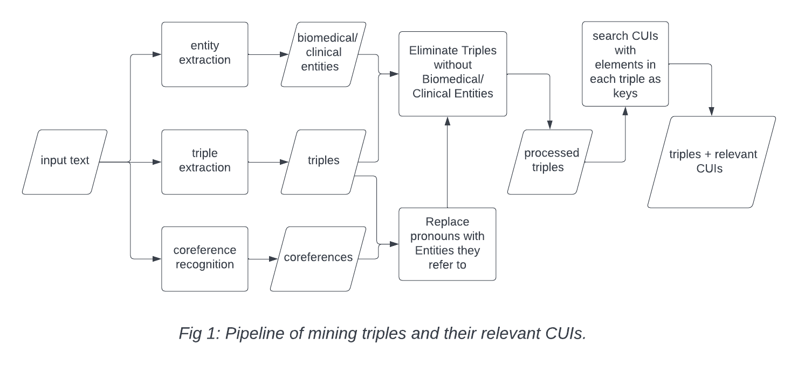
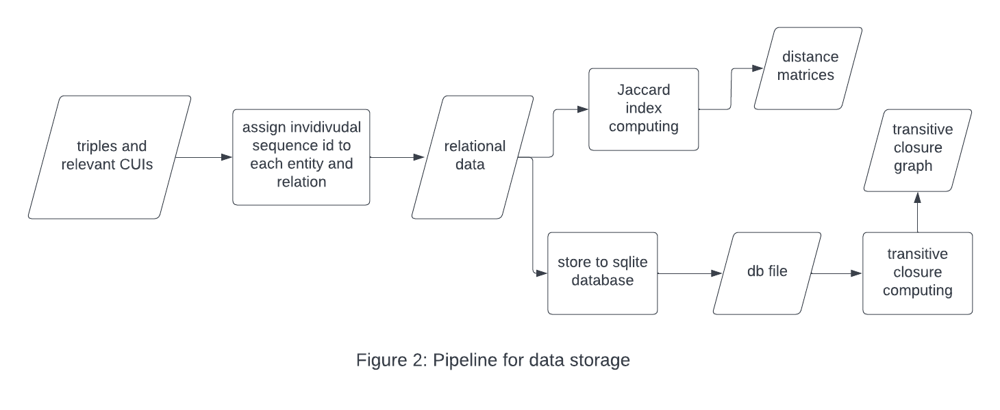

```{r setup, include=FALSE}
knitr::opts_chunk$set(echo = TRUE)
```

## Introduction

Information extraction (IE) has been used in biomedical and clinical fields for a wide range of applications, such as knowledge management (Kilicoglu et al., 2020; Wang et al., 2018). IE recognizes structured information, includes entities and relations between entities (Hong et al., 2021). Biomedical and clinical entities can be annotated with state-of-the-art performance by Stanza NLP library's biomedical and clinical English model (Zhang et al., 2020). However, Stanza does not provide the annotation of relations between entities. The Open Information Extraction (OpenIE) annotator of Stanford CoreNLP toolket (Manning et al., 2014) can extract open domain relation triples, which contains the relation itself, its subject, and its object (Angeli et al., 2015). The integration of triple extraction from Stanford CoreNLP with biomedical entity extraction from Stanza can potentially be a practical method for biomedical IE. This paper introduces a draft model that utilizes the output from Stanza and Stanford CoreNLP on information extraction. 


## Design

This model consists of two pipelines. The first pipeline extracts and processes the triples extracted from the input text (Fig 1). Besides Stanford CoreNLP OpenIE annotator and Stanza biomedical and clinical English model, at the beginning the input text is also parsed by Stanford CoreNLP CorefAnnotator, which identifies mentions of the same entity (Clark & Manning, 2016). The primary annotation extracts triples, biomedical entities, and references of the same entity. In the next step, if the output of the CorefAnnotator is informative about what any of pronominal subjects or objects in triples refer to, these pronominal elements will be replaced by the first mentions. After this update of triples, the triples whose 3 elements contain 0 extracted medical entities are eliminated. In the last part of this pipeline, if an element in a triple contain any extracted biomedical entities, that element will be searched in the Unified Medical Language System (UMLS) version 2022AB, and the associated concept unique Identifiers (CUI) are extracted (Bodenreider, 2004).This pipeline returns a list of dictionaries that each contain the elements of a triple and CUIs associated with each element.




The input for the second pipeline is the output of the first pipeline. Each relation and entity is assigned with a unique sequence ID (from 1 to the number of relations or entities). Each element without any associated CUI are has a unique sequence ID, and elements that are associated with at least one CUI are assigned with IDs based on their CUIs. After the unique sequence IDs are assigned, 3 relational tables are built. The first table stores the relation labels (columns: "relation_id", "CUIs", "text_reference"), the second label stores the entity labels (columns: "entity_id", "CUIs", "text_reference"), and the third table stores the relation triples (columns: "subject_id", "relation_id", "object_id"). The tables are next stored into a database (.db) file. This pipeline can compute a transitive closure table when a relation ID is given. Distance of matrices based on the associated CUIs can also be computed.




## Discussion

This model was attemped with 100 abstracts of publications from the Chronic Fatigue Syndrome Scientific Literature dataset (D'addario, 2022). The  i2b2 clinical model in Stanza biomedical and clinical English model packages was selected for clinical entity recognition. However, due to the lack of gold-standard labels or annotated data, no quantitative evaluation was performed. The priority of further development of this model is the design of methods that can assess the informativeness of extracted triples, especially triples whose both subjects and objects have more than 1 CUIs associated with them. 

One major problem during the attempt is the repetition in the triples. Open IE annotator sometimes extracts two triples that are basically same mentions in the original text, and the only difference is one's subject or object has extra modifier. For instance, ['fatigue syndrome', 'common symptom of is', 'malaise'] and ['myalgic fatigue syndrome', 'common symptom of is', 'malaise'] are two triples in the extracted results, although they are. That can cause more inaccuracy in the analysis of pipeline, because the two simialr subjects can have different associated CUIs that are searched from UMLS. For example, "myalgic fatigue syndrome" has only get 1 associated CUI, but "fatigue syndrome" has 11 associated CUIs.Therefore, further development should adopted a more sphisticated scale of sematic distance than Jaccard index.


## References

Angeli, G., Johnson, M., & Manning, C.D. (2015). Leveraging Linguistic Structure For Open Domain Information Extraction. Annual Meeting of the Association for Computational Linguistics.

Bested, A.C., & Marshall, L.M. (2015). Review of Myalgic Encephalomyelitis/Chronic Fatigue Syndrome: an evidence-based approach to diagnosis and management by clinicians. Reviews on Environmental Health, 30, 223 - 249.

Bodenreider, O. (2004). The Unified Medical Language System (UMLS): integrating biomedical terminology. Nucleic acids research, 32 Database issue, D267-70 .

Clark, K., & Manning, C.D. (2016). Deep Reinforcement Learning for Mention-Ranking Coreference Models. Conference on Empirical Methods in Natural Language Processing.

D'addario, A. (2022). Chronic Fatigue Syndrome Scientific Literature [Data set]. Kaggle. https://doi.org/10.34740/KAGGLE/DSV/3833832


Gurulingappa, H., Mateen-Rajput, A., & Toldo, L. (2012). Extraction of potential adverse drug events from medical case reports. Journal of biomedical semantics, 3(1), 15. https://doi.org/10.1186/2041-1480-3-15

Hong, Z., Ward, L.T., Chard, K., Blaiszik, B.J., & Foster, I.T. (2021). Challenges and Advances in Information Extraction from Scientific Literature: a Review. JOM.

Kilicoglu, H., Rosemblat, G., Fiszman, M., & Shin, D. (2020). Broad-coverage biomedical relation extraction with SemRep. BMC Bioinformatics, 21.

Le, H., Can, D., & Collier, N. (2022). Exploiting document graphs for inter sentence relation extraction. Journal of Biomedical Semantics, 13.

Manning, C.D., Surdeanu, M., Bauer, J., Finkel, J.R., Bethard, S., & McClosky, D. (2014). The Stanford CoreNLP Natural Language Processing Toolkit. Annual Meeting of the Association for Computational Linguistics.

Wang, Y., Wang, L., Rastegar-Mojarad, M., Moon, S., Shen, F., Afzal, N., Liu, S., Zeng, Y., Mehrabi, S., Sohn, S., & Liu, H. (2018). Clinical information extraction applications: A literature review. Journal of biomedical informatics, 77, 34-49 .

Zhang, Y., Zhang, Y., Qi, P., Manning, C.D., & Langlotz, C. (2020). Biomedical and clinical English model packages for the Stanza Python NLP library. Journal of the American Medical Informatics Association : JAMIA, 28, 1892 - 1899.